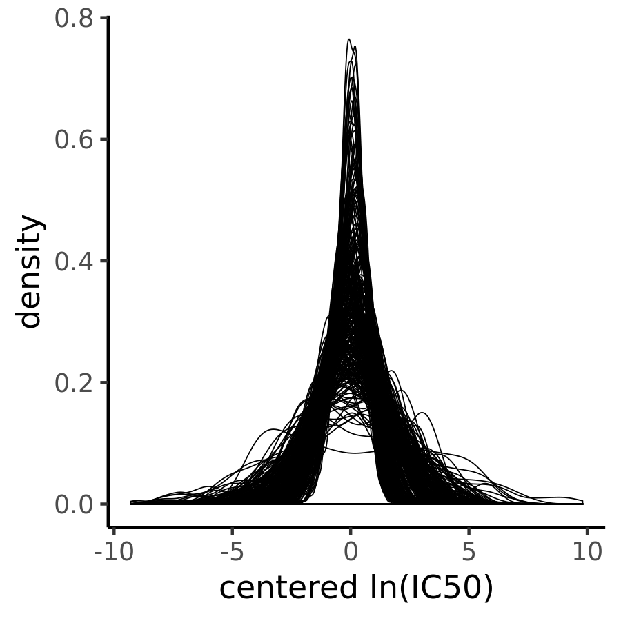

```{r setup, include=FALSE}
knitr::opts_chunk$set(echo = TRUE)
```

# Final Project

## Part 1:

In this project I use a dataset by the Genomics in Drug Sensitivity in Cancer Project. It contains genomic information for >1000 cancer cell lines together with in-vitro drug response information. The data can be used to find genomic biomarkers of drug response in cancer cell lines. In the future, this dataset will be maintained by the DepMap project, a joint effort by the Wellcome Trust Sanger Institute and the Broad Institute. The data is publicly available. 

*Who publishes the dataset?*
The data is published by the Genomics in Drug Sensitivity in Cancer Project. The project is a joint effort by the Cancer Genome Project, the Wellcome Trust Sanger institute and the Center for Molecular Therapeutics at MGH.

*Why do they publish it?*
The data is funded by public entitities, such as the Wellcome Trust and is published in scientific publications. To increase the access of the project's data, the data is freely available online.

*How frequently is it updated?*
The data is updated in an irregular schedule, when a batch of cancer cell line vulnerability data has been collected and pre-processed. The last update of the dataset was published in March 2018. 

*What variables does it contain?*
The dataset contains multiple tables: 
* meta-data about every cancer cell line, such as culture medium and tissue of origin. 
* copy-number variants for every cell line, in the form of a binary matrix
* gene expression data for every cell line, in the form of a numeric matrix
* drug response data for every cell line. The data contains *IC50* values for >60 drugs.

*How is it delivered?*
The data is available on the project's [website](https://www.cancerrxgene.org/downloads) and is split across multiple Excel files.

*Are there any restrictions on its use or availability?*
Yes, the data is subject to restrictions: *"Users have a non-exclusive, non-transferable right to use data files for internal, non-commercial research and educational purposes Please note: The data files are experimental and academic in nature and are not licensed or certified by any regulatory body. Genome Research Limited provides access to data files on an “as is” basis and excludes all warranties of any kind (express or implied)."*. 

*Does it make use of any standard (or proprietary) ontologies or terminologies?*
The data uses *COSMIC IDs* to identify cell lines. The gene expression data is annotated using the [Ensemble](https://useast.ensembl.org/index.html) nomenclature. The gene mutation dataset is annotated using the *HUGO* terminology. The drugs tested are not linked to a standardized ontology. 

*What are some questions that have been asked previously using the data? *
Previously, this data has been used to find predictive models to link genetic markers with drug response [Iorio et al., 2016](https://www.cell.com/fulltext/S0092-8674(16)30746-2). In addition visualization projects have created [applications](https://journals.plos.org/plosone/article?id=10.1371/journal.pone.0176763) to explore this dataset.

## Part 2:

I downloaded the respective tables and preprocessed the drug response data by log transforming and median centering IC50 values for each drug over every cell line. By transforming IC50 values this way, we can compare drug effects between both cell lines and drugs. 



Prior studies in mouse models of epithelial cancers suggests, that the main driver of superiority of combination cancer therapy over single-agent regimen is not biochemical synergy between agents, but an increased probability of either one of the agents causing a therapeutic effect in a patient's disease. According to this theory, combination treatments with agents that have anti-correlated response profiles are interesting candidate compound for further clinical evaluation. In their original study the authors demonstrate that in fact the majoarity of currently administred combination treatments in oncology are not positiviely correlated. 

In this study, my goal is to identify new potential combinations of therapeutics that are anticorrelated. Because oncology today is a highly specialized field, it is not sufficient to only identify compounds that are anti-correlated from a pan-cancer perspective. Instead, I will run multiple correlation analysis on subsets of cancer cell lines defined by tissue of origin or mutation status. Because, the estimation of correlation coefficients is not stable with different numbers of samples and subsetting of the dataset leads to very small subgroups, I have to introduce methods to estimate the credible intervals of correlation coefficients.


Visualize key variables
Use a supervised or unsupervised machine learning method to explore a question
Do (at least) one of the following:
Load the data into a relational database management system
Use NLP to analyze part of the data
Build an app that helps other people explore the data
Some other extension (discuss with Adam)
Part 3:

Write up your findings in a 7-10 page report.  You can format the report however you’d like, but make sure to cover both Parts 1 and 2.  The audience for your report is other students in the class – we’ll share the reports so that everyone can learn about all the datasets.  Sell them on your dataset!  Tell them what they could do with it, how to get it, how to use it, etc.  If your project goes well, you may also be able to submit this report as a journal paper.  You’ll also give a presentation on the dataset at the end of the semester – more details to come on the presentations.