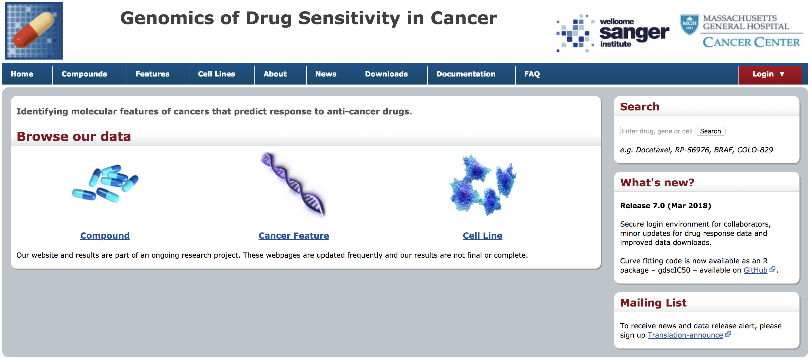
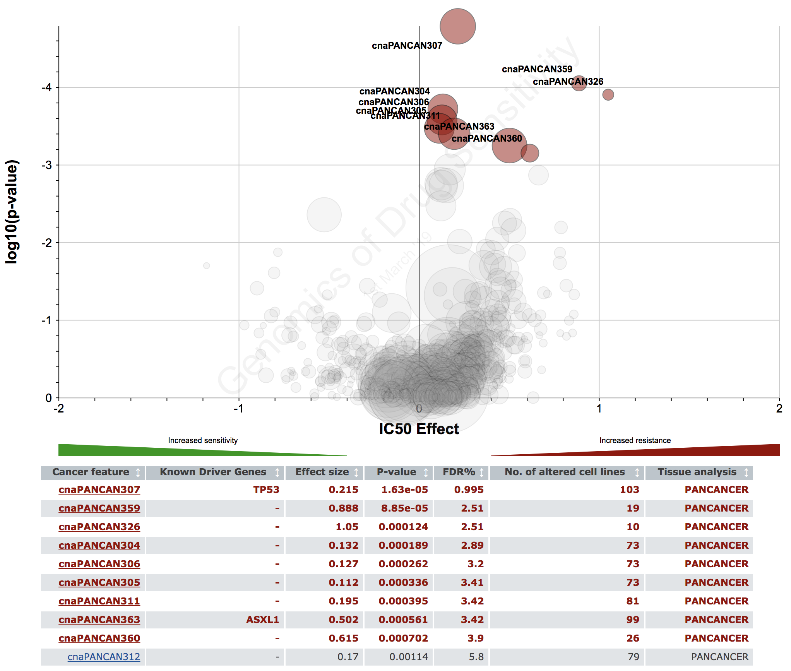
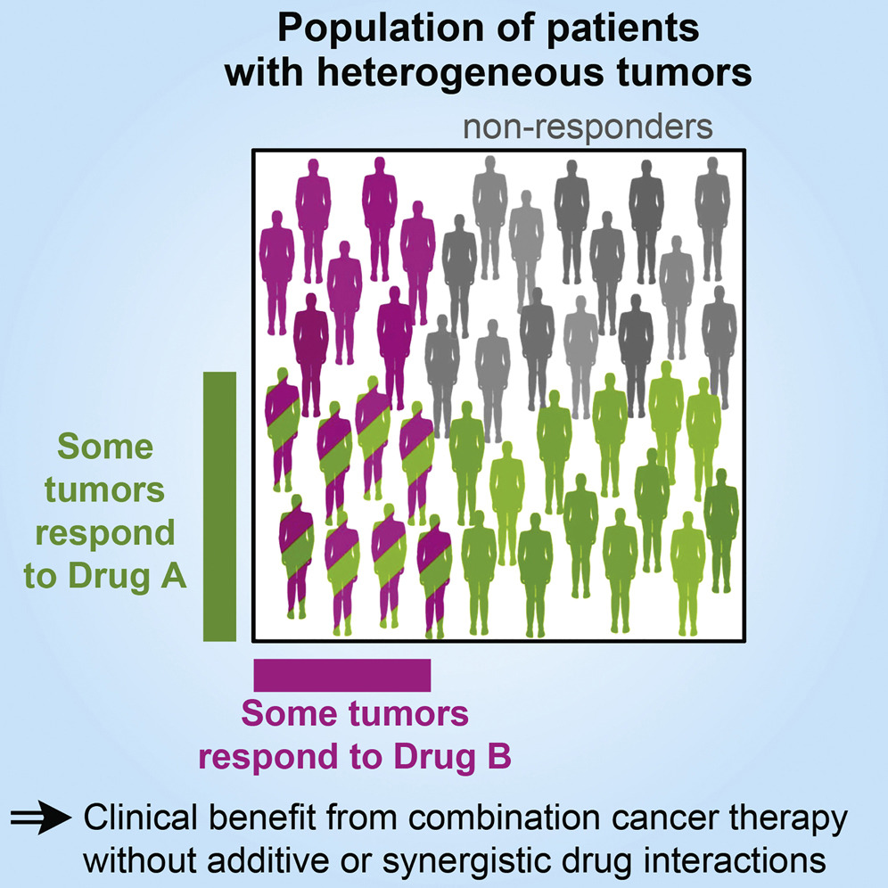
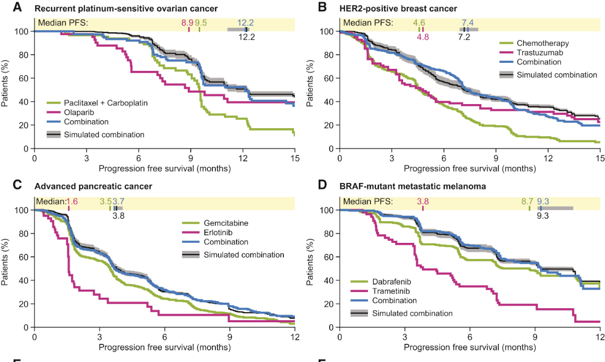
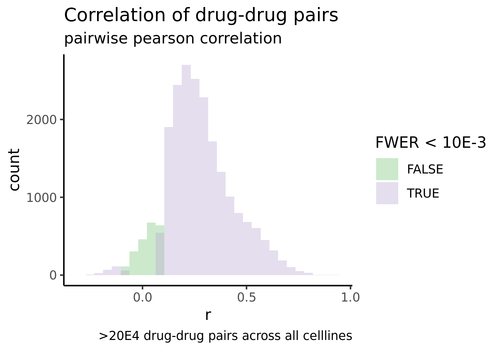
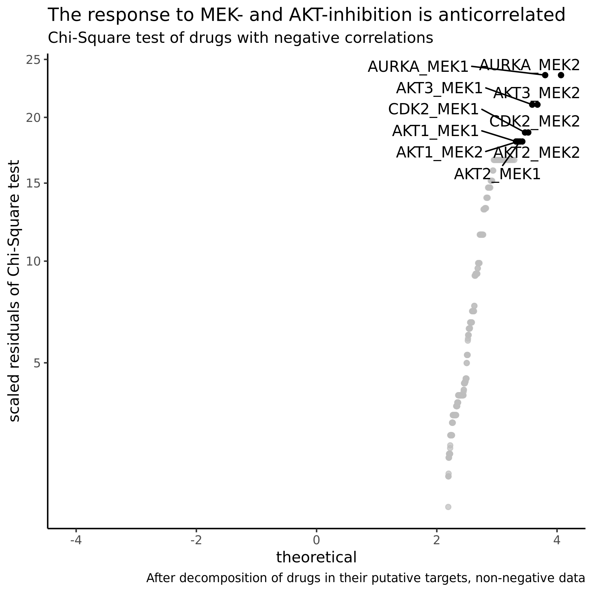
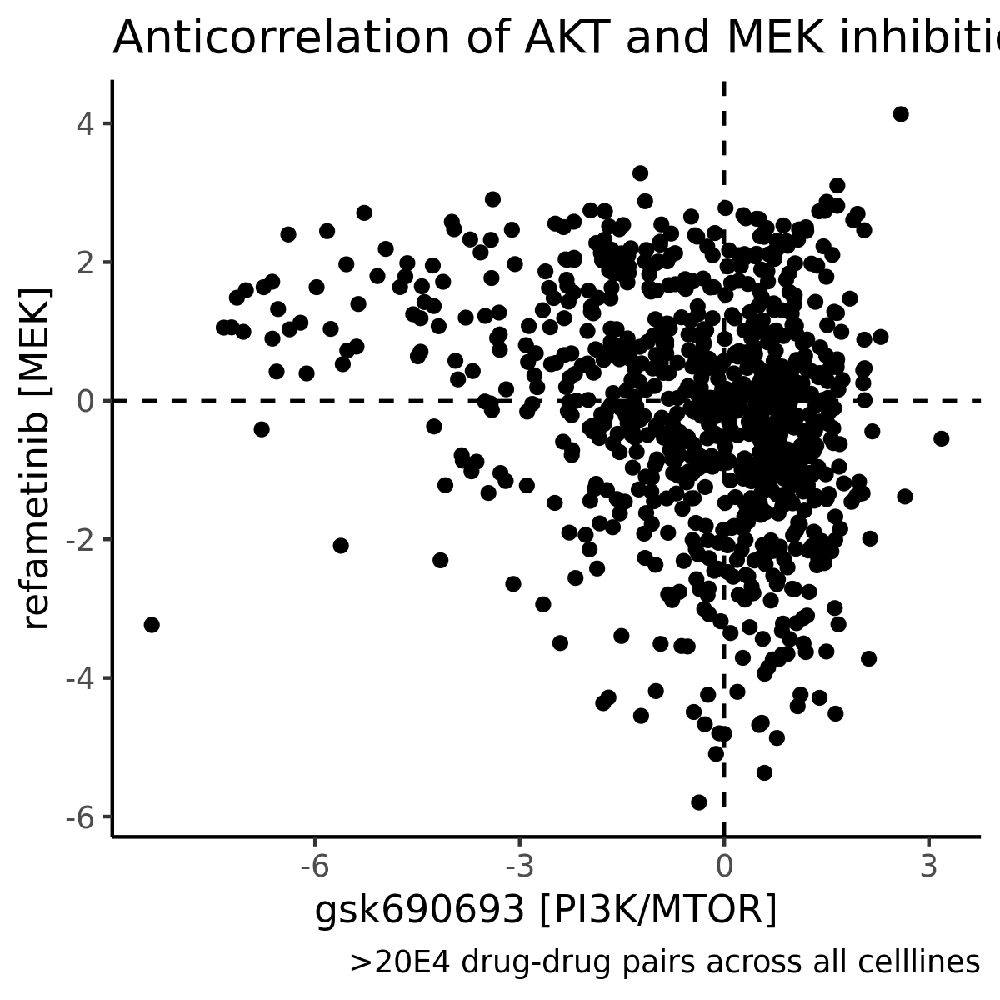
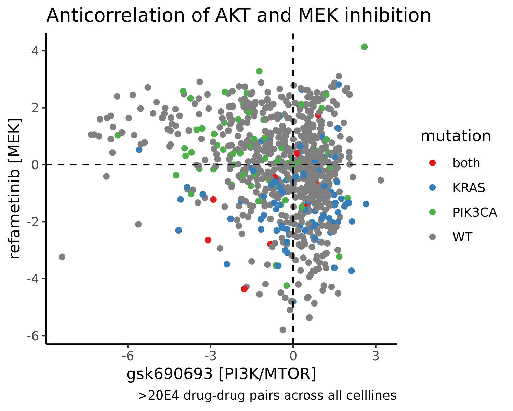

```{r setup, include=FALSE}
knitr::opts_chunk$set(echo = TRUE)
```

# Final Project

## Introduction 

Cancer is an extremely heterogenous disease. While the availability of genomic testing of tumors is continously increasing, linking the correct drug to the right patient remains a challenge. Part of this challenge is the difficulty to predict drug responses to a large number of drugs based on a tumors genetic profile.

In order to increase our understanding of how genetic markers predict drug response, laboratory tumor models, such as 2D cancer cell lines, can be treated with a large number of therapeutics in-vitro. The drug response of these tumor models, in combination with their genetic data, can then be associated. 

## Part 1: The CancerRxGene Dataset

In this project I present the [**CancerRxGene Dataset**](https://www.cancerrxgene.org/translation/Drug/179#vp) by the Genomics in Drug Sensitivity in Cancer Project. It contains genomic information for >1000 cancer cell lines together with in-vitro drug response information. The data can be used to find genomic biomarkers of drug response in cancer cell lines. In the future, this dataset will be maintained by the DepMap project, a joint effort by the Wellcome Trust Sanger Institute and the Broad Institute. The data is publicly available. To the best of my knowledge, it is one of the greates non-commercial drug sensitivity datasets in cancer models.



**Who publishes the dataset?**
The data is published by the Genomics in Drug Sensitivity in Cancer Project. The project is a joint effort by the Cancer Genome Project, the Wellcome Trust Sanger institute and the Center for Molecular Therapeutics at MGH.

**Why do they publish it?**
The data is funded by public entitities, such as the Wellcome Trust and is published in scientific publications. To increase the access of the project's data, the data is freely available online.

**How frequently is it updated?**
The data is updated in an irregular schedule, when a batch of cancer cell line vulnerability data has been collected and pre-processed. The last update of the dataset was published in March 2018. 

**What variables does it contain?**
The dataset contains multiple tables: 
* meta-data about every cancer cell line, such as culture medium and tissue of origin. 
* copy-number variants for every cell line, in the form of a binary matrix
* gene expression data for every cell line, in the form of a numeric matrix
* drug response data for every cell line. The data contains *IC50* values for >60 drugs.

**How is it delivered?**
The data is available on the project's [website](https://www.cancerrxgene.org/downloads) and is split across multiple Excel files.

**Are there any restrictions on its use or availability?**
Yes, the data is subject to restrictions: *"Users have a non-exclusive, non-transferable right to use data files for internal, non-commercial research and educational purposes Please note: The data files are experimental and academic in nature and are not licensed or certified by any regulatory body. Genome Research Limited provides access to data files on an “as is” basis and excludes all warranties of any kind (express or implied)."*. 

**Does it make use of any standard (or proprietary) ontologies or terminologies?**
The data uses *COSMIC IDs* to identify cell lines. The gene expression data is annotated using the [Ensemble](https://useast.ensembl.org/index.html) nomenclature. The gene mutation dataset is annotated using the *HUGO* terminology. The drugs tested are not linked to a standardized ontology. 

**What are some questions that have been asked previously using the data?**
Previously, this data has been used to find predictive models that link genetic markers with drug response [Iorio et al., 2016](https://www.cell.com/fulltext/S0092-8674(16)30746-2). In addition visualization projects have created [applications](https://journals.plos.org/plosone/article?id=10.1371/journal.pone.0176763) to explore this dataset.



\newpage

## Part 2: Identification of potential personalized cancer combination therapies under a non-synergy assumption

### Introduction

Recent [simulation analysis](https://linkinghub.elsevier.com/retrieve/pii/S0092-8674(17)31318-1) of clinical trials assessing the activity of combination cancer therapies suggest, that the main driver of superiority of drug combinations over single-agent regimens is not biochemical synergy between drugs, but an increased probability of either one of the drugs causing a therapeutic effect in a patient's disease. According to this theory, combination treatments with agents that have anti-correlated response profiles are interesting candidate compounds for further clinical evaluation. In their original study the authors demonstrate that in fact the majority of currently administred combination treatments in oncology are not positiviely correlated. 



In this study, my goal is to identify new potential combinations of therapeutics that are anticorrelated in one of the largest in-vitro cancer drug sensitivity datasets. Because oncology today is a highly specialized field, it is not sufficient to only identify compounds that are anti-correlated from a pan-cancer perspective. Instead, I will run multiple correlation analysis on subsets of cancer cell lines defined by tissue of origin or mutation status. Because, the estimation of correlation coefficients is not stable with differing number of samples and subsetting of the dataset leads to very small subgroups, I have introduced a Bayesian sampling based method to estimate the credible intervals of correlation coefficients for small genetically defined subgroups. I have identified an anti-correlation of highly active MEK and AKT inhibitors across all available cancer types. Amongst many, Bayesian estimation of correlation coefficients identified NGFR receptor inhibition as a strong candidate combination for MEK inhibitors in Melanoma, thereby confirming [prior reports](http://msb.embopress.org/content/13/1/905) of de-differentiation based drug resistance to MEK inhibition.



### Correlation analysis of drug sensitivity profiles identifies mutually exclusive sensitivity to MEK and AKT inhibition.

We preprocessed the drug response data by log transforming and median centering IC50 values for each drug over every cell line. By transforming IC50 values this way, we are able to compare drug effects between both cell lines and drugs.


After preprocessing drug response scores, I performed Pearson correlation analyses of pairwise complete observations for each unqiue pair of drug sensitivity vectors. 



I used available compound mechanism of action information to link every pair to the molecular targets it was inhibiting. Chi-Square testing of molecular targets in the significantly negative correlated pairs showed a strong enrichment for the combined inhibition of MEK and AKT. 



In-depth analysis of the anti-correlation pattern between MEK and AKT inhibitors showed a mutually exclusive response pattern to either MEK or AKT inhibition, while the majority of tumore cells did not respond to both treatments. 



Sensitivity to MEK inhibition and AKT inhibition has previously beek linked to the mutation status of biomarkers, such as *KRAS* or *PI3K*. In line with these associations, KRAS mutant cancer cells were more sensitive to MEK inhibition as were PIK3CA mutant cells to AKT inhibition. 




### Bayesian subgroup-restricted correlation analysis identifies potential tissue- and genotype-specific combination therapies.

As the previous example illustrates, known genotype- and tissue-specific predictors of drug sensitivity can underlie anti-correlation patterns, thereby reducing the clinical value of such drug combinations in a genetically-informed clinical practice. In order to identify drug combinations in more specific subgroups of cancer models, which share common genetic features of tissue types, I performed multiple correlation analyses in subgroups of cancer cell lines. 

To this end, I identified more than 50 genotype or tissue related features that are at least present in more than 2% of all available cancer models. After grouping models by features and performing subgroup-specific correlation analyses I observed a strong heteroscedasdicity of correlation coefficients, depending on the size of the respective subgroup. 

#![Increased variance of correlation coefficients as subgroup size decreases]


### Curating a database of drug response and genomic information of cancer models


